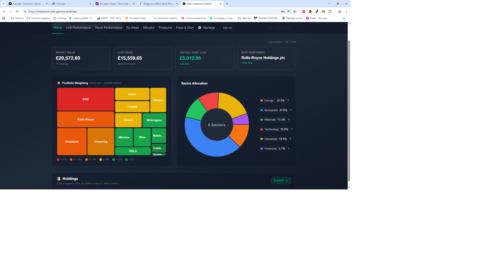
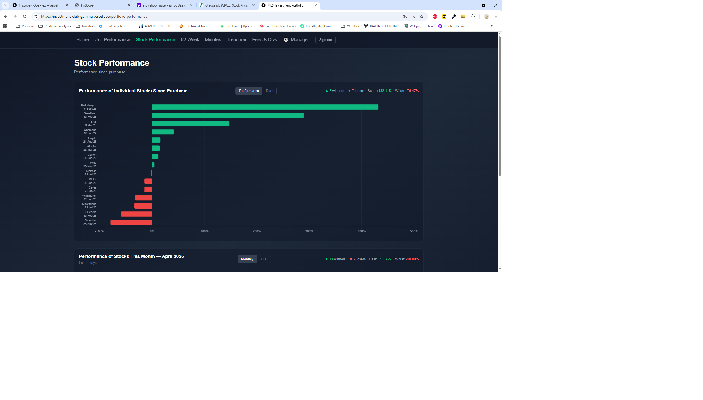
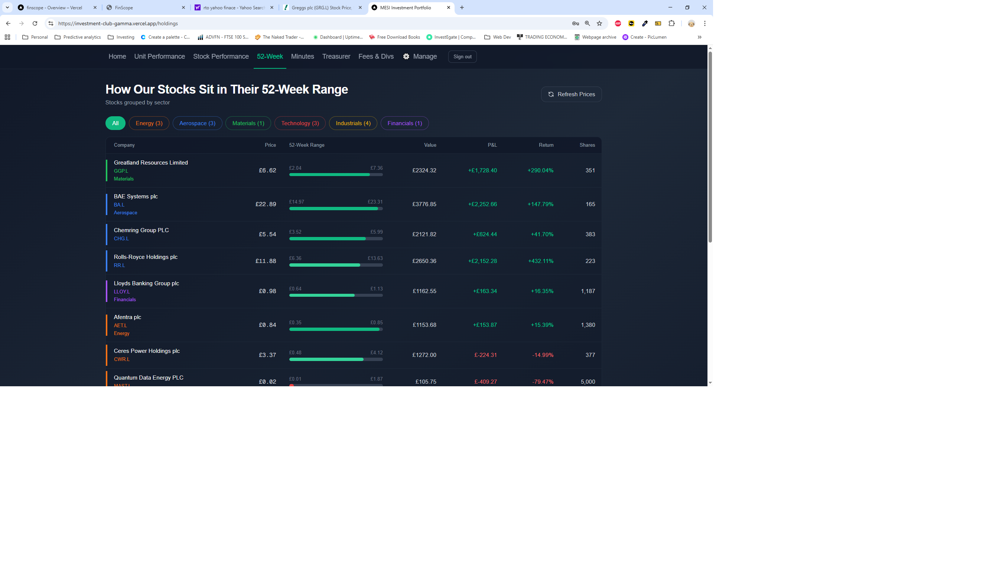

# MESI Investment Club Dashboard

A full-stack web application for managing and tracking a small investment club portfolio. Built with Next.js, Supabase, and Tailwind CSS — deployed on Vercel.


---

## Screenshots

### Home — Portfolio Overview


### Unit Value Performance


### Stock Performance


### 52-Week Range


---

## Features

### Portfolio Management

- Live share prices fetched from Yahoo Finance
- Current value, average cost, and P&L per holding
- Full portfolio summary with total return since inception

### Transaction History

- Complete log of all buy and sell transactions
- Add new transactions with shares, price, and commission
- Automatic position and cost basis calculation

### Unit Value Performance

- Automatic PDF extraction from monthly treasurer valuation reports
- Unit value progression charted over time
- FTSE 100 & FTSE 250 benchmark overlay (rebased to same start point)
- Monthly breakdown table with percentage change and since-inception return
- Toggle between relative performance and raw unit value views

### General Performance

- Individual share performance since purchase (horizontal bar chart)
- Monthly performance for the current month via Yahoo Finance
- Monthly return boxes for full history with FTSE 100 comparison
- Dividend income tracking with YTD totals

### Portfolio Fees

- Running costs calculator:
  - £9 dealing fee per buy/sell transaction
  - 0.5% stamp duty on buys (per-holding exclusions supported)
  - 0.2% p.a. custody fee estimated quarterly

### Treasurer's Reports

- Upload and store monthly PDF valuation reports
- Auto-ordered by valuation date extracted from PDF
- One-click sync to extract unit values from new PDFs
- Sync button protected by separate admin password

### Meeting Minutes

- Store and view club meeting minutes

### Access Control

- Site-wide login page with JWT-based session authentication
- Separate admin password for treasurer functions
- Sessions persist across page loads without re-entering the password

---

## Tech Stack

| Layer        | Technology                                  |
| ------------ | ------------------------------------------- |
| Frontend     | Next.js 16 (App Router), React 19, TypeScript |
| Styling      | Tailwind CSS v4                             |
| Database     | Supabase (PostgreSQL)                       |
| File Storage | Supabase Storage                            |
| Charts       | Recharts, Chart.js, Lightweight Charts      |
| PDF Parsing  | pdf-parse-fork, pdf-lib                     |
| Price Data   | Yahoo Finance API                           |
| Auth         | JWT sessions via jose                       |
| Deployment   | Vercel                                      |

---

## Database Schema

```sql
-- Treasurer PDF reports
treasurer_reports (id, title, date, content, file_url, file_name, created_at)

-- Extracted unit values from PDFs
unit_values (id, report_id, file_name, valuation_date, unit_value, created_at)

-- Portfolio transactions
transactions (id, holding_id, type, date, shares, price_per_share, total_cost, commission)

-- Holdings reference data
holdings (id, name, ticker, sector)

-- Dividend records
dividends (id, holding_id, date, amount, currency, notes)
```

---

## Getting Started

### Prerequisites

- Node.js 18+
- A Supabase project
- A Vercel account (for deployment)

### 1. Clone the repository

```bash
git clone https://github.com/your-username/investment_club.git
cd investment-club-dashboard
```

### 2. Install dependencies

```bash
npm install
```

### 3. Set up environment variables

Create a `.env.local` file in the project root:

```env
NEXT_PUBLIC_SUPABASE_URL=https://your-project.supabase.co
NEXT_PUBLIC_SUPABASE_ANON_KEY=your-anon-key
SUPABASE_SERVICE_ROLE_KEY=your-service-role-key
CLUB_PASSWORD=your-club-password
ADMIN_PASSWORD=your-admin-password
JWT_SECRET=a-long-random-secret-string
```

### 4. Set up the database

Run the SQL migrations in your Supabase SQL editor. Migration files are in the `migrations/` directory.

### 5. Run the development server

```bash
npm run dev
```

Open [http://localhost:3000](http://localhost:3000) in your browser.

---

## Project Structure

```
├── app/
│   ├── api/
│   │   ├── auth/                  # Login / logout endpoints
│   │   ├── fundamentals/          # Stock fundamentals data
│   │   ├── historical-prices/     # Historical price data
│   │   ├── holdings/              # Holdings CRUD
│   │   ├── monthly-performance/   # Monthly share price changes
│   │   ├── performance/
│   │   │   ├── sync/              # PDF extraction & unit value sync
│   │   │   └── benchmarks/        # Rebased benchmark data
│   │   ├── prices/                # Live share prices
│   │   ├── transactions/          # Transaction CRUD
│   │   ├── treasurer/             # Treasurer report management
│   │   └── unit-values/           # Unit value data
│   ├── data/                      # Static data files
│   ├── history/                   # Transaction history page
│   ├── holdings/                  # Holdings page
│   ├── login/                     # Login page
│   ├── manage/                    # Admin management page
│   ├── minutes/                   # Meeting minutes page
│   ├── performance/               # Unit value performance page
│   ├── portfolio-fees/            # Portfolio fees page
│   ├── portfolio-performance/     # General performance page
│   ├── treasurer/                 # Treasurer reports page
│   ├── AuthGuard.tsx              # Client-side auth protection wrapper
│   ├── layout.tsx                 # Root layout
│   ├── metadata.ts                # Shared metadata config
│   └── page.tsx                   # Home / dashboard page
├── components/
│   ├── Navigation.tsx             # Responsive nav (hamburger on mobile)
│   ├── PasswordProtect.tsx        # Legacy password gate component
│   └── RefreshButton.tsx          # Data refresh button
├── lib/
│   ├── performance.ts             # Unit value data & benchmark helpers
│   ├── portfolio.ts               # Portfolio data fetching & calculations
│   ├── session.ts                 # JWT session helpers
│   └── supabase.ts                # Supabase client
├── migrations/                    # SQL migration files
├── types/
│   └── index.ts                   # TypeScript interfaces
└── scripts/                       # Utility scripts
```

---

## Monthly Workflow

Each month when the treasurer produces a new valuation report:

1. Go to the **Treasurer** page
2. Click **+ Upload Report** and upload the PDF
3. Click **Sync Performance** and enter the admin password
4. The unit value and valuation date are automatically extracted from the PDF
5. The Unit Value Performance chart updates immediately

---

## Deployment

The app is deployed on Vercel. Every push to the `main` branch triggers an automatic redeployment.

Add the same variables from `.env.local` in the Vercel dashboard under **Settings → Environment Variables**.

---

## Licence

Private project — MESI Investment Club. Not licensed for public use.
